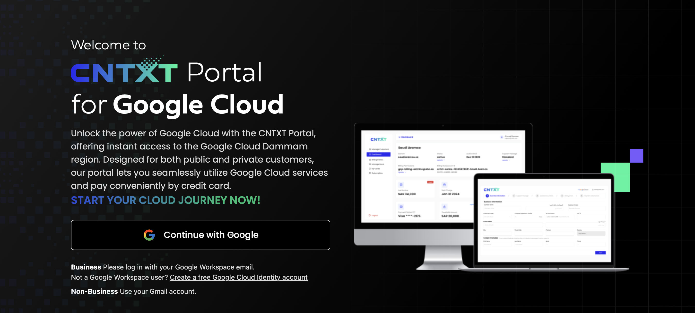

# GCP Account Setup Guide (KSA Context)

In the Kingdom of Saudi Arabia (KSA), Google Cloud Platform (GCP) is handled through a special process. Due to the unavailability of the free trial in the kingdom, your GCP account will be linked with Le Wagon’s billing account, allowing you to enjoy GCP products responsibly.

## Step-by-Step Instructions

1. **Login to Cloud Console**
   - Go to [cloud.cntxt.com](https://cloud.cntxt.com) and log in using the Google Cloud account associated with the Gmail address you are using for this bootcamp.
   

2. **Fill in Required Information**
   - Fill in all the necessary information as shown in the provided reference image. Ensure that all the information is accurate and correct.

3. **Select a Plan**
   - Select the **Free Plan**. *(You may choose the paid plan at your own risk and cost.)*

4. **Enter Payment Details**
   - Fill in the payment details. Don’t worry about the charges; your billing account will be switched to Le Wagon's account.

5. **Account Settings**
   - Set your account type as **Individual** and select **Saudi Arabia** as your country.

6. **Create Your Account**
   - Proceed with creating your account.

7. **Create Your First Project**
   - Open a new tab and navigate to the **Create Your Project** section.
   - You will be prompted to confirm your account for Saudi Arabia. Follow the instructions and continue.
   - Create a project name. For example, you can name it **LW-Datascience**.

8. **Access Your Dashboard**
   - Once done, return to the previous page and open your CNTXT dashboard. It should resemble the reference image provided.

9. **Migrate to Le Wagon’s Billing Account**
   - We will now migrate your profile to Le Wagon’s billing account. Follow these steps carefully:
     - Copy-paste the billing account ID from Le Wagon as shown in the reference image.
     - Double-check the information and submit the migration request.

10. **Wait for Migration Confirmation**
    - The migration process officially takes up to 7 days, though it could be instant or completed by the next day.

11. **Manage Your Credits**
    - Once the migration is complete, you are good to go! Set up alerts on your project to monitor credits and avoid any unexpected charges.

---

Feel free to reach out if you encounter any issues during the setup process. Happy cloud computing!
