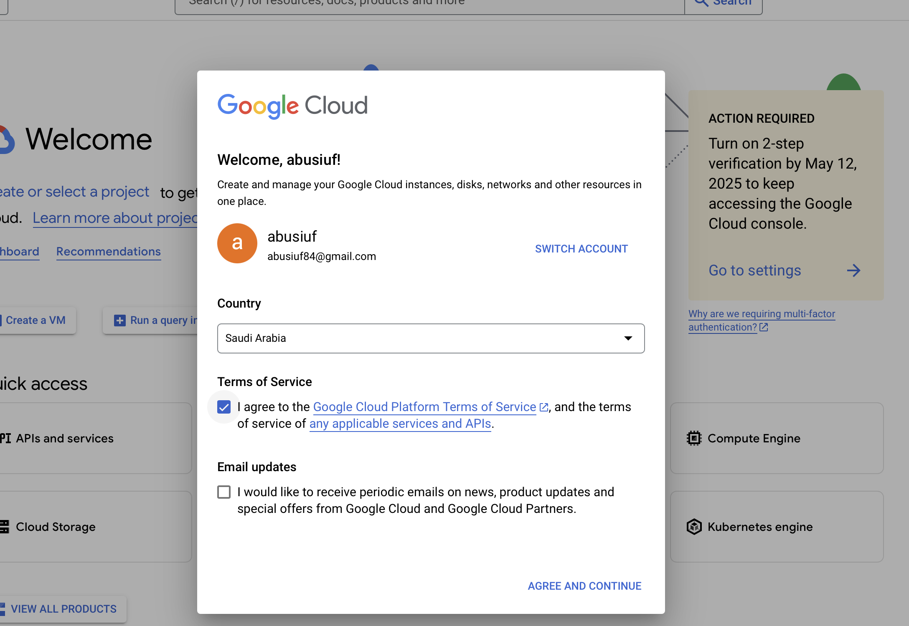
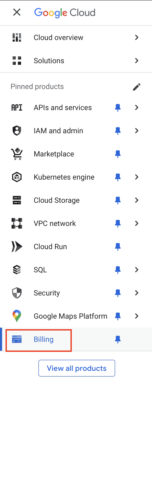
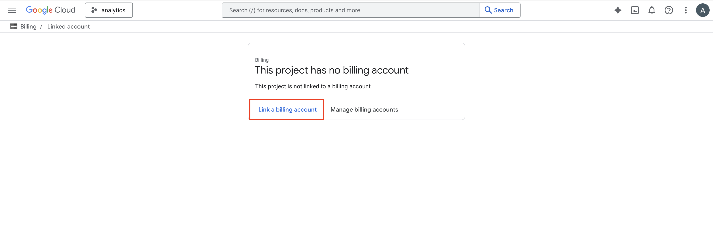
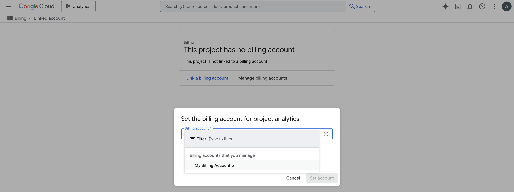

# GCP Account Setup Guide (KSA Context)

In the Kingdom of Saudi Arabia (KSA), Google Cloud Platform (GCP) is handled by a third-party company.

Regarding their policies, it's not possible to create individual account free of charges.

The steps below will allow students to be host on external free trial account and enjoy amazing GCP products.


# Students instructions

## Creating and setting project & billing account

Students have actually two choices for the setup, either through the console, either through google cloud.

Visit the website console.google.com and do as the picture below.



After that, act depeding of your option (CLI should be the quickest one)

### CLI (The easiest way)

First, we will save the Billing account ID provided by Le Wagon to your environment. Be sure to change accordingly the part of the code with <BILLING_ACCOUNT> 👇

```bash
echo "export BILLING_ACCOUNT='<BILLING_ACCOUNT>'" >> ~/.zshrc
```

Then :
```bash
exec zsh
```


```bash
echo "export MY_GPROJECT='Lewagon-${GITHUB_USERNAME}-DS'" >> ~/.zshrc
exec zsh
```

❌ Depending on your GH username, you may face an issue. If it's the case please contact a TA 🙋‍♂️


```bash
#gcloud components update
gcloud billing accounts list


# Create project
gcloud projects create "${MY_GPROJECT}"

gcloud config set project "${MY_GPROJECT}"

# Set billing account
gcloud billing projects link "${MY_GPROJECT}" --billing-account ${BILLING_ACCOUNT}

# Set budget alerts per 1$
gcloud billing budgets create \
	--billing-account="${BILLING_ACCOUNT}" \
	--display-name="${MY_GPROJECT}" \
	--filter-projects=projects/"${MY_GPROJECT}" \
	--budget-amount=5 \
	--threshold-rule=percent=0.20 \
	--threshold-rule=percent=0.40 \
	--threshold-rule=percent=0.60 \
	--threshold-rule=percent=0.80

```

❌ If an error appeared, call the BM / TA 🙋‍♂️

### GCP Website


If you have done already the steps through CLI, just skip that part. ⏩
<details>
<summary>👉&nbsp;&nbsp;Setup using website 👈</summary>
Select through the hamburger menu at the top right the billing section.



Once you have clicked, you should arrived on this page with two options

Select link a billing account.



Finally, select the billing account provided by the BM to you.



If any questions or doesn't seem to work, raise a ticket 🙋‍♂️

Please check with your BM the whole setup ✔️

 </details>


## Service accounts and last part of set up

Last part of the setup, we need to create a service account and configure it on your computer so GCP can identify you and you'd be able to launch gcloud command from your machine ! 💻

Check the current project:

```bash
gcloud config get-value project
```
This command retrieves the currently set project ID in your gcloud configuration.
It's important to ensure you're working in the correct project before proceeding with other commands.

If at this point you have an error ❌, call a TA. 🙋‍♂️
If the project is not the one you've set up, call a TA. 🙋‍♂️

Create a service account:

```bash
gcloud iam service-accounts create my-service-account --display-name "My Service Account"
```
This command creates a new service account named "my-service-account" with the display name "My Service Account".
Service accounts are used to authenticate applications and services to Google Cloud resources.

Grant the service account owner role:

```bash
gcloud projects add-iam-policy-binding ${MY_GPROJECT} --member="serviceAccount:my-service-account@${MY_GPROJECT}.iam.gserviceaccount.com" --role="roles/owner"
```
This command adds the "owner" role to the newly created service account for the specified projects.
This grants full access to all resources in the project, so use with caution.

Create a key for the service account:

```bash
gcloud iam service-accounts keys create key.json --iam-account=my-service-account@${MY_GPROJECT}.iam.gserviceaccount.com
```
This generates a new private key for the service account and saves it as "key.json"3. This key file is used to authenticate as the service account.


Move the key file:

```bash
mkdir ~/code/${GITHUB_USERNAME}/GCP
mv key.json ~/code/${GITHUB_USERNAME}/GCP/
```
This command moves the "key.json" file to a specific directory in your home folder. Replace ${GITHUB_USERNAME} with your actual GitHub username.
Set the GOOGLE_APPLICATION_CREDENTIALS environment variable:

```bash
echo "export GOOGLE_APPLICATION_CREDENTIALS='/~/code/${GITHUB_USERNAME}/GCP/key.json'" >> ~/.zshrc
```
This adds an export command to your .zshrc file, setting the GOOGLE_APPLICATION_CREDENTIALS environment variable to the path of your key file. This allows Google Cloud client libraries to automatically find and use the credentials for authentication.
