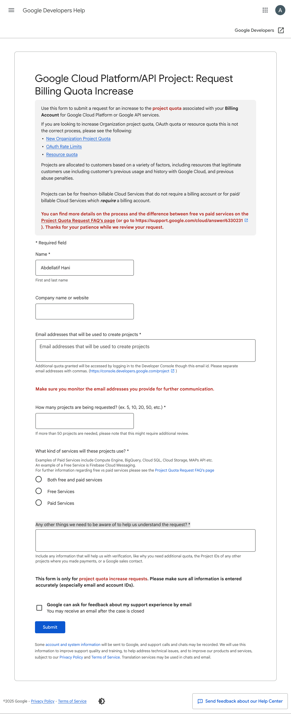

# GCP Account Setup Guide (KSA Context)

In the Kingdom of Saudi Arabia (KSA), Google Cloud Platform (GCP) is handled by a tyranious company who let no space for people to use GCP freely ☭ . Due to the unavailability of the free trial in the kingdom, students will be hosted on Lewagon's billing account allowing them to enjoy GCP products responsibly.

# Teachers Instructions

## **Increase quotas form**

In order to host as mluch student on one billing account, BM are asked to fill the [related form](https://support.google.com/code/contact/billing_quota_increase) to ask an increase to 25-50 project.

It will ask the following information:
- First and last name
- Company Name (LW or Lewagon doesn't matter)
- Email adresses (students one, if the information is missing, it's possible to just give some or write "TBC")
- Number of requested projects (25-50)
Which kind of services ( both free and paid services)
- Any other things we need to be aware of to help us understand the request? (Just explain the situation, don't forget to mention it's for academical purposes)

## **Billing account Management**

From the hamburger menu, go to Billing section. Once you landed the page, click on manage billing account.

## **Add student on the billing**

Once you have selected you billing account, we'll add students and give them the role of billing account administrator (that will allow them to link their iwn project to this billing account).

