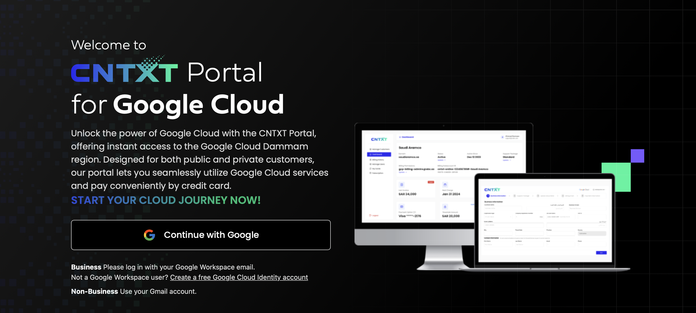
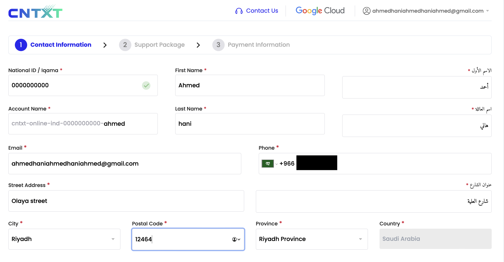
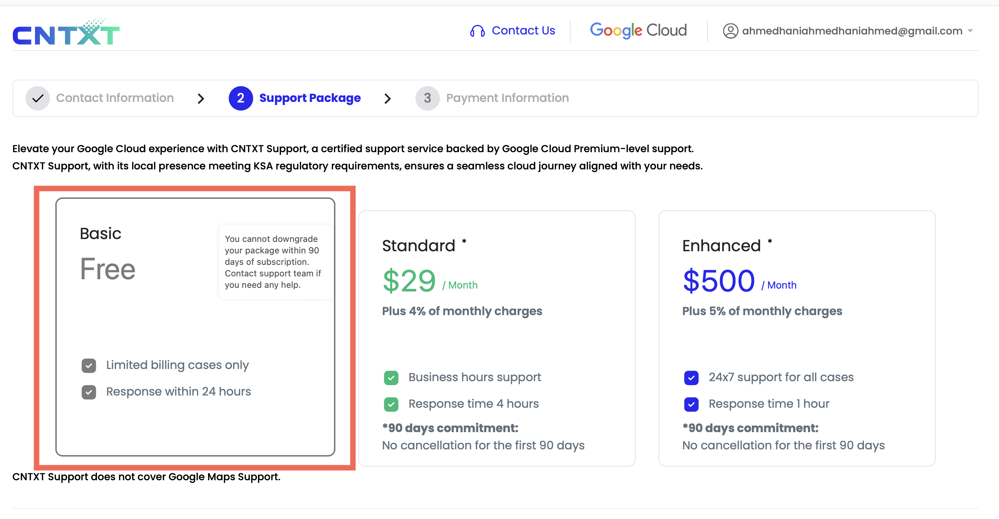
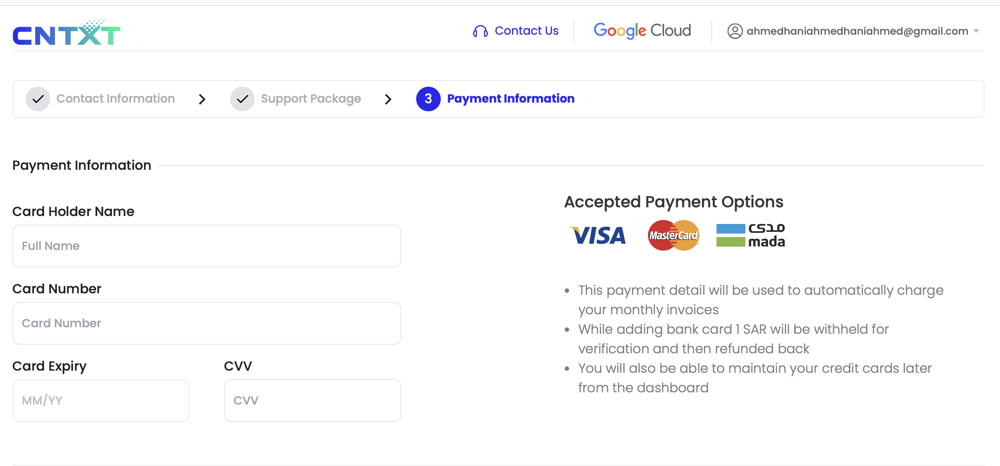
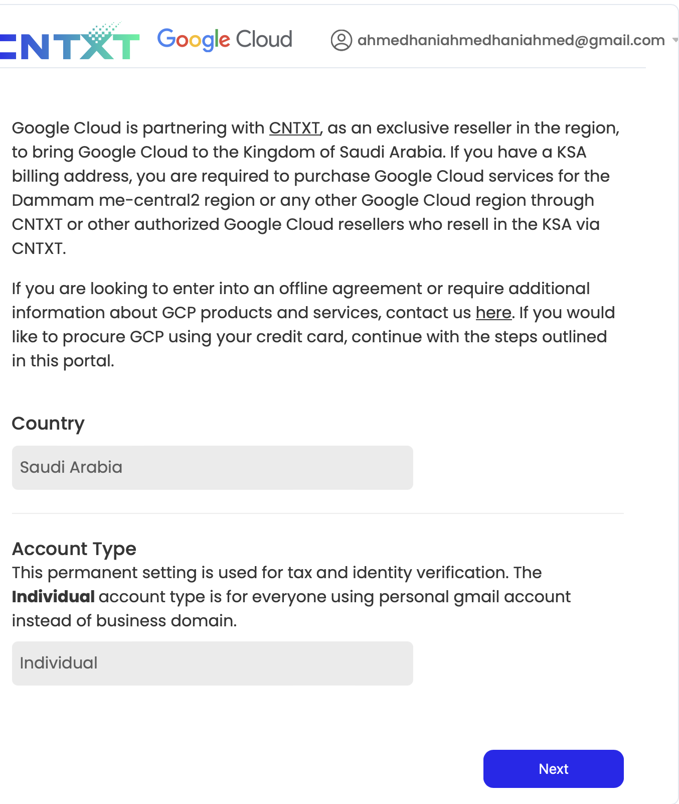
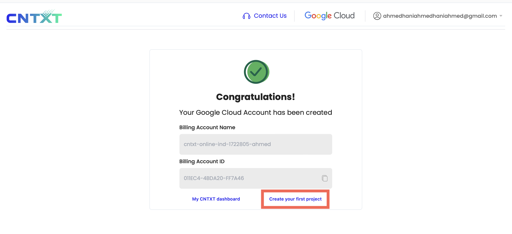
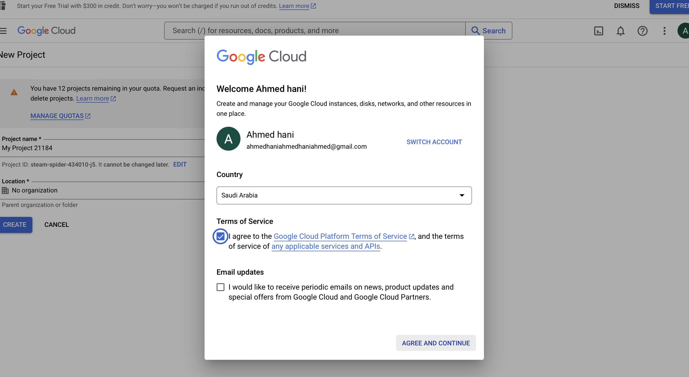
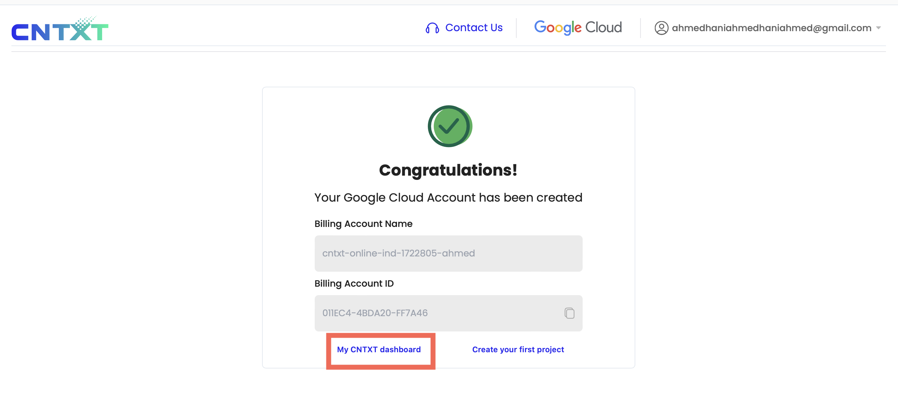
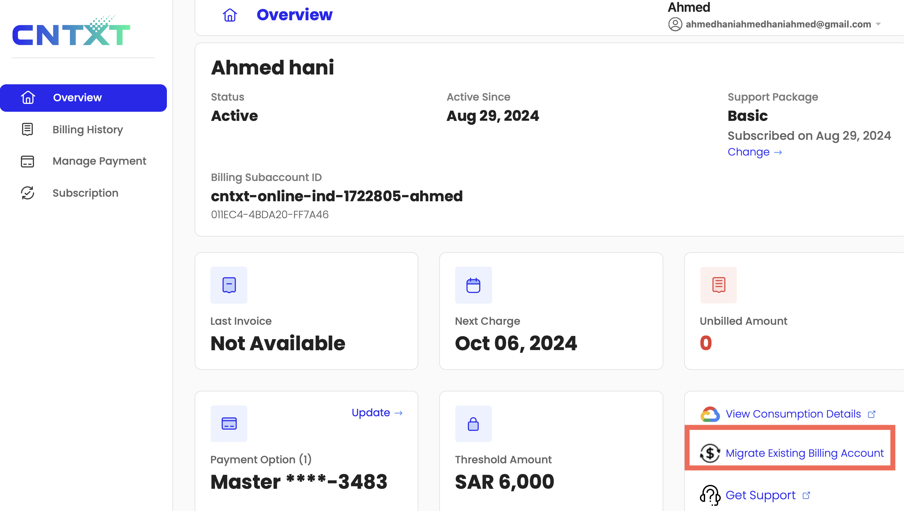
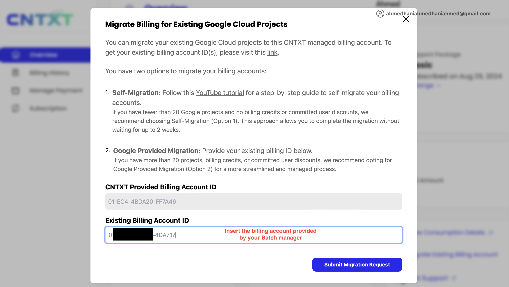

# GCP Account Setup Guide (KSA Context)

In the Kingdom of Saudi Arabia (KSA), Google Cloud Platform (GCP) is handled through a special process. Due to the unavailability of the free trial in the kingdom, your GCP account will be linked with Le Wagon’s billing account, allowing you to enjoy GCP products responsibly.

## Step-by-Step Instructions

1. **Login to Cloud Console**
   - Go to [cloud.cntxt.com](https://cloud.cntxt.com) and log in using the Google Cloud account associated with the Gmail address you are using for this bootcamp.
   


2. **Fill in Required Information**
   - Fill in all the necessary information as shown in the provided reference image. Ensure that all the information is accurate and correct.
   


3. **Select a Plan**
   - Select the **Free Plan**. *(You may choose the paid plan at your own risk and cost.)*
   

4. **Enter Payment Details**
   - Fill in the payment details. Don’t worry about the charges; your billing account will be switched to Le Wagon's account.
   

5. **Account Settings**
   - Set your account type as **Individual** and select **Saudi Arabia** as your country.
   


6. **Create Your Account**
   - Proceed with creating your account.

7. **Create Your First Project**
   - Open a new tab and navigate to the **Create Your Project** section.
   
   - You will be prompted to confirm your account for Saudi Arabia. Follow the instructions and continue.
   
   - Create a project name. For example, you can name it **LW-Datascience**.


8. **Access Your Dashboard**
   - Once done, return to the previous page and open your CNTXT dashboard. It should resemble the reference image provided.
   


9. **Migrate to Le Wagon’s Billing Account**
   - We will now migrate your profile to Le Wagon’s billing account. Follow these steps carefully:
   
     - Copy-paste the billing account ID from Le Wagon as shown in the reference image.
     - Double-check the information and submit the migration request.
    


10. **Wait for Migration Confirmation**
    - The migration process officially takes up to 7 days, though it could be instant or completed by the next day.
    

11. **Manage Your Credits**
    - Once the migration is complete, you are good to go! Set up alerts on your project to monitor credits and avoid any unexpected charges.

---

### Create a service account key 🔑

Now that you have created a `GCP account` and a `project` (identified by its `PROJECT_ID`), we are going to configure the actions (API calls) that you want to allow your code to perform.

<details>
  <summary>🤔 Why do we need a service account key ?</summary>


  You have created a `GCP account` linked to your credit card. Your account will be billed according to your usage of the resources of the **Google Cloud Platform**. The billing will occur if you consume anything once the free trial is over, or if you exceed the amount of spending allowed during the free trial.

  In your `GCP account`, you have created a single `GCP project`, identified by its `PROJECT_ID`. The `GCP projects` allow you to organize and monitor more precisely how you consume the **GCP** resources. For the purpose of the bootcamp, we are only going to create a single project.

  Now, we need a way to tell which resources within a `GCP project` our code will be allowed to consume. Our code consumes GCP resources through API calls.

  Since API calls are not free, it is important to define with caution how our code will be allowed to use them. During the bootcamp this will not be an issue and we are going to allow our code to use all the API of **GCP** without any restrictions.

  In the same way that there may be several projects associated with a GCP account, a project may be composed of several services (any bundle of code, whatever its form factor, that requires the usage of GCP API calls in order to fulfill its purpose).

  GCP requires that the services of the projects using API calls are registered on the platform and their credentials configured through the access granted to a `service account`.

  For the moment we will only need to use a single service and will create the corresponding `service account`.
</details>

Since the [service account](https://cloud.google.com/iam/docs/service-accounts) is what identifies your application (and therefore your GCP billing account and ultimately your credit card), you are going to want to be cautious with the next steps.

⚠️ **Do not share you service account json file 🔑** ⚠️ Do not store it on your desktop, do not store it in your git codebase (even if your git repository is private), do not let it by the coffee machine, do not send it as a tweet.

- Go to the [service accounts page](https://console.cloud.google.com/apis/credentials/serviceaccountkey)
- Select your project in the list of recent projects if asked to
- Create a service account:
  - Click on **CREATE SERVICE ACCOUNT**:
  - Give a `Service account name` to that account
  - Click on **CREATE AND CONTINUE**
  - Click on **Select a role** and choose `Quick access/Basic` then **Owner**, which gives full access to all resources
  - Click on **CONTINUE**
  - Click on **DONE**
- Download the service account json file 🔑:
  - Click on the newly created service account
  - Click on **KEYS**
  - Click on **ADD KEY** then **Create new key**
  - Select **JSON** and click on **CREATE**


The browser has now saved the service account json file 🔑 in your downloads directory (it is named according to your service account name, something like `le-wagon-data-123456789abc.json`)


We will now move the service account json file from your Windows disk to the Ubuntu disk. This will allow the development tools in Ubuntu to access to the resources of your GCP account.

First, let's create a directory in which we will store the file.

👉 Open an Ubuntu terminal and run the following commands

🚨 replace `GITHUB_NICKNAME` by your **GitHub** nickname

``` bash
cd ~/code/GITHUB_NICKNAME
ls -la
```

If the command does not show the `dotfiles` directory, ask for a TA 🙏

Otherwise, you can proceed with the setup:

``` bash
mkdir gcp
```


We will now move the service account json file to the `gcp` directory we just created.

Open a Windows **File Explorer** (Win + E) and locate the `gcp` directory in the Ubuntu file system.

You can either:
- Use the **Quick access** link that we created earlier
- manually type the location of the `gcp` directory in the Ubuntu file system in the address bar:

```
\\wsl$\Ubuntu\home\UBUNTU_USERNAME\code\GITHUB_NICKNAME
```


🚨 if you opt for the second option:
- replace `UBUNTU_USERNAME` by the username that you choose during the **Ubuntu** setup
- replace `GITHUB_NICKNAME` by your **GitHub** nickname


Once you have located the `gcp` directory in the Windows **File Explorer**, move the service account json file that you downloaded inside of it.

The file should now be visible from Ubuntu file system.

👉 Open an Ubuntu terminal and verify that the service account json file has been moved

``` bash
cd gcp
ls -la
```


If you do not see the service account json file listed in the `gcp` directory, ask for a TA 🙏

We will now store the path to your service account json file in an environment variable.

🚨 in the following command, replace:
- `UBUNTU_USERNAME` by the username that you choose during the **Ubuntu** setup
- `GITHUB_NICKNAME` by your **GitHub** nickname
- `SERVICE_ACCOUNT_JSON_FILE_CONTAINING_YOUR_SECRET_KEY.json` by the name of your service account json file

``` bash
echo 'export GOOGLE_APPLICATION_CREDENTIALS=/home/UBUNTU_USERNAME/code/GITHUB_NICKNAME/gcp/SERVICE_ACCOUNT_JSON_FILE_CONTAINING_YOUR_SECRET_KEY.json' >> ~/.zshrc
```
**Note:** every time you run this command, it will add this line to your zshrc file regardless of whether you already have it. If you made a mistake and need to fix it, preferably open the file and edit the line!

You can do so by running

```bash
code ~/.zshrc
```

in the Terminal! 😄


<details>
  <summary>ℹ️ How to find the absolute path of a file?</summary>
  You can drag and drop the file in your terminal.
</details>

**Restart** your terminal and run:

``` bash
echo $GOOGLE_APPLICATION_CREDENTIALS
```

The ouptut should be the following:

```bash
/some/absolute/path/to/your/gcp/SERVICE_ACCOUNT_JSON_FILE_CONTAINING_YOUR_SECRET_KEY.json
```

Now let's verify that the path to your service account json file is correct:

``` bash
cat $(echo $GOOGLE_APPLICATION_CREDENTIALS)
```

👉 This command should display the content of your service account json file. If it does not, ask for a TA 🙏

Your code and utilities are now able to access the resources of your GCP account.

Let's proceed with the final steps of configuration...

- List the service accounts associated to your active account and current project
```bash
gcloud iam service-accounts list
```
- Retrieve the service account email address, e.g. `SERVICE_ACCOUNT_NAME@PROJECT_ID.iam.gserviceaccount.com`
- List the roles of the service account from the cli (replace PROJECT_ID and SERVICE_ACCOUNT_EMAIL)
```bash
gcloud projects get-iam-policy PROJECT_ID \
--flatten="bindings[].members" \
--format='table(bindings.role)' \
--filter="bindings.members:SERVICE_ACCOUNT_EMAIL"
```
- You should see that your service account has a role of `roles/owner`

<details>
  <summary>Troubleshooting</summary>

- `AccessDeniedException: 403 The project to be billed is associated with an absent billing account.`
  - Make sure that billing is enabled for your Google Cloud Platform project https://cloud.google.com/billing/docs/how-to/modify-project
</details>

🏁 You are done with the GCP setup!


## Kitt

:warning: If you have received an email from Le Wagon inviting you to sign up on Kitt (our learning platform), you can safely skip this step. Instead, please follow the instructions in the email you received if you haven't done so already.

If you are unsure about what to do, you can follow [this link](https://kitt.lewagon.com/). If you are already logged in, you can safely skip this section. If you are not logged in, click on `Enter Kitt as a Student`. If you manage to login, you can safely skip this step. Otherwise ask a teacher whether you should have received an email or follow the instructions below.

Register as a Wagon alumni by going to [kitt.lewagon.com/onboarding](http://kitt.lewagon.com/onboarding). Select your batch, sign in with GitHub and enter all your information.

Your teacher will then validate that you are indeed part of the batch. You can ask them to do it as soon as you completed the registration form.

Once the teacher has approved your profile, go to your email inbox. You should have 2 emails:

- One from Slack, inviting you to the Le Wagon Alumni slack community (where you'll chat with your buddies and all the previous alumni). Click on **Join** and fill the information.
- One from GitHub, inviting you to `lewagon` team. **Accept it** otherwise you won't be able to access the lecture slides.


## Slack

[Slack](https://slack.com/) is a communcation platform pretty popular in the tech industry.

### Installation

[Download the Slack app](https://slack.com/downloads/windows) and install it.

:warning: If you are already using Slack in your browser, please download and install **the desktop app** which is fully featured.


### Settings

Launch the app and sign in to `lewagon-alumni` organization.

Make sure you **upload a profile picture** :point_down:


The idea is that you'll have Slack open all day, so that you can share useful links / ask for help / decide where to go to lunch / etc.

To ensure that everything is working fine for video calls, let's test your camera and microphone:
- Open the Slack app
- Click your profile picture in the top right.
- Select `Preferences` from the menu.
- Click `Audio & video` in the left-side column.
- Below `Troubleshooting`, click `Run an audio, video and screensharing test`. The test will open in a new window.
- Check that your preferred speaker, microphone and camera devices appear in the drop-down menus, then click `Start test`.


:heavy_check_mark: When the test is finished, you should see green "Succeed" messages at least for your microphone and camera. :+1:

:x: If not, **contact a teacher**.

You can also install Slack app on your phone and sign in `lewagon-alumni`!


## (Bonus) Kata

If you are done with your setup, please ask around if some classmates need some help with theirs (macOS, Linux, Windows). We will have our first lectures at 2pm and will talk about the Setup you just did + onboard you on Kitt.

If you don't have a lot of experience with `git` and GitHub, please [(re-)watch this workshop](https://www.youtube.com/watch?v=Z9fIBT2NBGY) (`1.25` playback speed is fine).

If you do, then you can wait for the first lecture working on this [Tic-Tac-Toe Kata](https://www.codewars.com/kata/5b817c2a0ce070ace8002be0/train/python)


Feel free to reach out if you encounter any issues during the setup process. Happy cloud computing!
