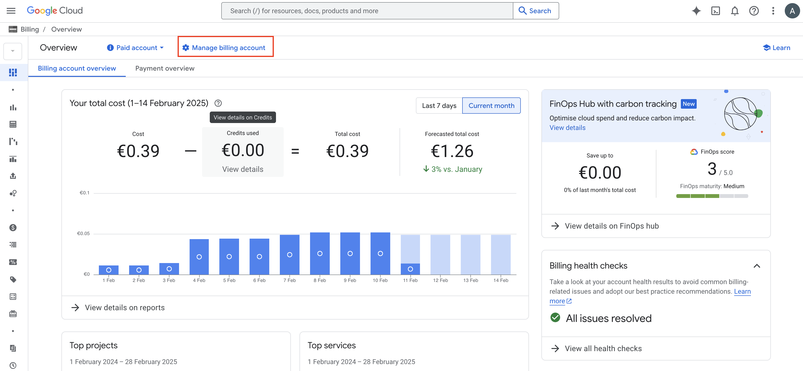
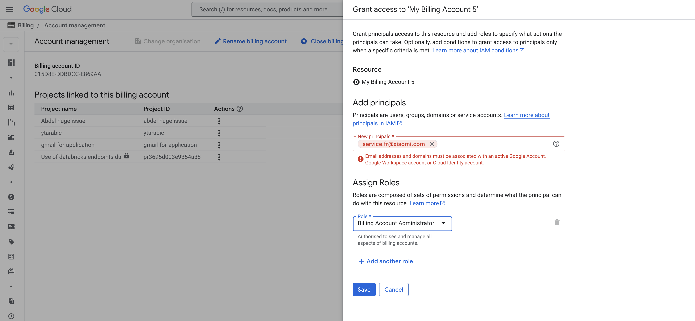

# GCP Account Setup Guide (KSA Context)

In the Kingdom of Saudi Arabia (KSA), Google Cloud Platform (GCP) is handled by a third-party company.

Regarding their policies, it's not possible to create individual account free of charges.

The steps below will allow students to be host on external free trial account and enjoy amazing GCP products.

# Process & Schedule

**Prerequisite for students**:

- Obtain a gmail account
- Communicate with the BM

## W1

Day 1 :

- Students do the regular setup without GCP Setup instructions are on a dedicated link: [Setup - no gcp](https://github.com/lewagon/data-setup/blob/nogcp/README.md)

## W2

- BM creates and send a [Google Form](https://docs.google.com/forms/d/1yn0gJSPVCpsN_WGM1oOsJtZVnS6Jsp98EJ4NQmEb--4) to collect student gmail addresses
- Students submit gmail account through the Google Form

    >
    >
    >
    > Hello @channel
    >
    > We will prepare GCP setup for the next week.
    >
    > Can you go to the form here and submit your gmail account?
    >

—> Ask the PM to prepare the repartition / account (LW staff / “freelance settuper” prepared accounts with quotas already attributed by google and company card setup in billing profil. Please reach out to your PM to ask for the accounts you can use and where do you have to add your students)
template

## **W3**

  
👉&nbsp;&nbsp;BM add student gmail account as “billing account administrator”  👈

# Teachers Instructions

## **Billing account Management**

From the hamburger menu, go to Billing section. Once you landed the page, click on manage billing account.

## **Add student on the billing**

Once you have selected you billing account, we'll add students and give them the role of billing account administrator (that will allow them to link their iwn project to this billing account).

The BM / PM should provide you a gsheet with student's name, emails and related billing account ID.

- Prepare the list of your students x billing account affected to send it to them ([Template](https://docs.google.com/spreadsheets/d/1n8KJ0jKzDwiuaqMUBX_o6tROJ5Pqg6GcJlb6pt3uRQo/edit?usp=sharing))

## **W4**

- BM communicates to students that they should do the GCP part of the setup - `send them this message :`
    -

    >
    >
    >
    > Hello @channel,
    >
    > Next week we will start MLOps week on Google Cloud Platform  A.K.A GCP :gcp:
    >
    > For you to be able to use GCP services, you need to follow the step below :point_down:
    >
    > Student guide : https://github.com/Abdl242/gcp-ksa/blob/master/gcp-students.md
    >
    > To make it simple, you'll create a project through CLI command and link it to the one billing account provided by Lewagon.
    >
    > To know which billing account to use, please check the one allocated to you on this gsheet :google-sheets-intensifies:
    >
    > Let me know through tickets if you face any issue or need further explanations. :hand:
    >
- Students do the GCP part of the setup :

     [Students guide](https://github.com/Abdl242/gcp-ksa/blob/master/gcp-students.md)

- Students confirm ✅ that they have finished the setup
- BM follows up everyone finished
